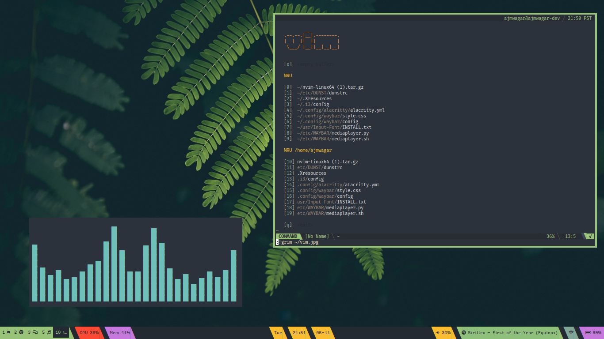
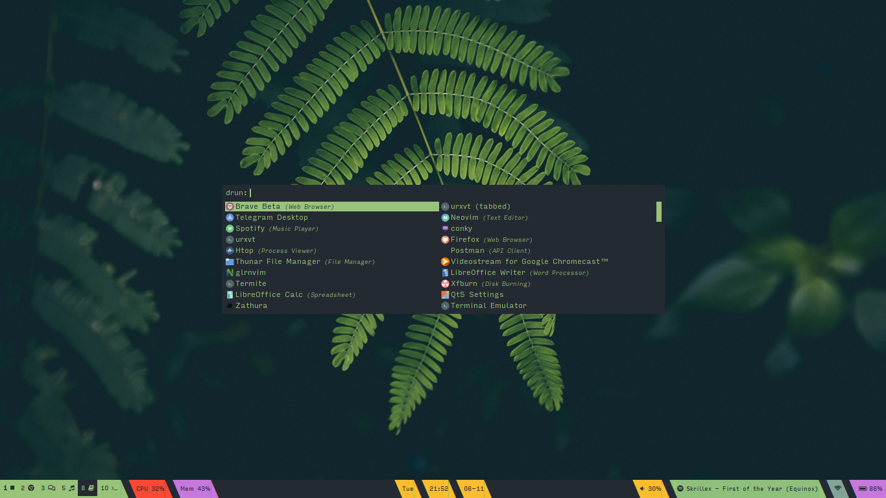
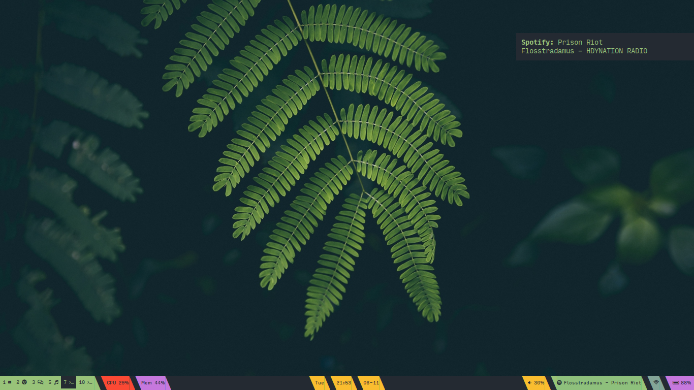

```
              ▄▄                         ▄▄▄▄      ██     ▄▄▄▄                         
              ██              ██        ██▀▀▀      ▀▀     ▀▀██                         
         ▄███▄██   ▄████▄   ███████   ███████    ████       ██       ▄████▄   ▄▄█████▄ 
        ██▀  ▀██  ██▀  ▀██    ██        ██         ██       ██      ██▄▄▄▄██  ██▄▄▄▄ ▀ 
        ██    ██  ██    ██    ██        ██         ██       ██      ██▀▀▀▀▀▀   ▀▀▀▀██▄ 
        ▀██▄▄███  ▀██▄▄██▀    ██▄▄▄     ██      ▄▄▄██▄▄▄    ██▄▄▄   ▀██▄▄▄▄█  █▄▄▄▄▄██ 
          ▀▀▀ ▀▀    ▀▀▀▀       ▀▀▀▀     ▀▀      ▀▀▀▀▀▀▀▀     ▀▀▀▀     ▀▀▀▀▀    ▀▀▀▀▀▀  
```

# Setup Description
-----------------
- Bar `waybar`
- Browser `brave`
- Compositor `sway`
- IRC client `weechat`
- File Manager `thunar`
- Font `Input Mono`
- Media player `vlc`
- Music player `spotify`
- Program launcher `rofi`
- PDF viewer `zathura`
- Text editor `nvim`
- Terminal emulator `alacritty`
- Window manager `sway`

# Installation 
------------

1. Clone this repo.

`git clone https://github.com/ajmwagar/dotfiles ~/etc/`

2. Change directory to dotfiles and install using symbolic links ;)
```bash
# Change to dotfiles
cd ~/etc/

# Link Configs

ln ~/etc/COMPTON/compton.conf ~/.config/compton.conf
ln ~/etc/I3/config ~/.i3/config # i3-gaps
ln ~/etc/XRESOURCES ~/.Xresources # Xresources (rofi, urxvt, etc.)
ln ~/etc/ZSH/zshrc ~/.zshrc # zsh (oh-my-zsh)
ln ~/etc/WAYBAR ~/.config/waybar # waybar
ln ~/etc/ALACRITTY/alacritty.yml ~/.config/alacritty/alacritty.yml # alacritty

# Neovim Config
git clone https://github.com/ajmwagar/vimkampf.git ~/.config/nvim

```
3. Profit!


### sway


### rofi


### dunst


<!--### polybar
-->

<!--### alacritty
-->
